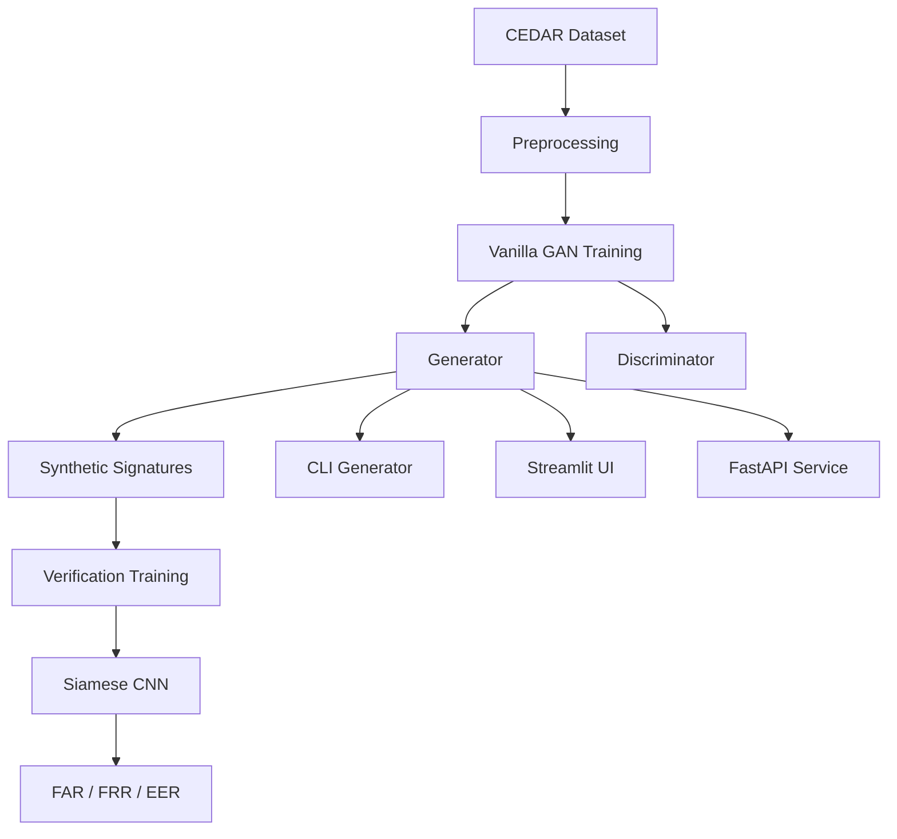

# Handwritten Signature Generation and Verification using Vanilla GAN

This project implements an end-to-end pipeline for offline handwritten signature generation and verification using **Vanilla Generative Adversarial Networks (GANs)** and a **Siamese Convolutional Neural Network (CNN)**.  
Synthetic signatures generated by GANs are used to augment scarce genuine signature data and improve verification robustness on the CEDAR Offline Signature Dataset.

---

## 📌 Project Introduction

Offline handwritten signatures are still widely used in banks, universities, e-governance systems, and legal institutions for identity verification. However, practical signature verification systems suffer from:

- Limited genuine samples per user  
- Scarcity of skilled forgeries  
- High intra-personal variation in handwriting  

Conventional data augmentation techniques fail to capture realistic stroke-level variations.  
This project explores the use of a **Vanilla GAN** to learn the distribution of handwritten signatures and generate **realistic synthetic samples**, which are then used to augment training data for a **signature verification model**.

---

## 🎯 Key Features

- **Generic Vanilla GAN** trained on genuine signatures from multiple users  
- **User-specific Vanilla GANs** fine-tuned per signer to capture intra-personal variation  
- **Siamese CNN–based signature verification model**  
- **GAN-based data augmentation** for verification training  
- **CEDAR dataset preparation scripts** (raw → structured format)  
- **Streamlit UI** for interactive signature generation  
- **FastAPI service** returning a ZIP of generated signatures  
- **Evaluation framework** reporting FAR, FRR, and EER  

---

## 🧭 System Overview

- **Dataset:** CEDAR Offline Handwritten Signature Dataset  
- **Generative Model:** Vanilla GAN (Generator + Discriminator)  
- **Training Modes:** Generic GAN and User-Specific GANs  
- **Verification Model:** Siamese CNN  
- **Evaluation Metrics:** FAR, FRR, EER  
- **Deployment:** CLI tools, Streamlit UI, FastAPI API  

---

## 📁 Project Structure

```text
project2/
├── data/
│   └── cedar/
│       ├── genuine/            # Genuine signatures per user
│       └── forgery/            # Skilled forgeries per user
├── generated/
│   └── generic/                # Generated signatures (generic GAN)
├── checkpoints/
│   ├── generic/                # Generic GAN & verifier checkpoints
│   └── user_specific/          # User-specific GAN generators
├── samples/                    # Training sample grids
├── scripts/
│   └── prepare_cedar.py
├── src/
│   ├── api.py
│   ├── app.py
│   ├── preprocess_signatures.py
│   ├── data_loader_signatures.py
│   ├── generator_vanilla_gan.py
│   ├── discriminator_vanilla_gan.py
│   ├── vanilla_gan_model.py
│   ├── train_gan_generic.py
│   ├── train_gan_user_specific.py
│   ├── generate_signatures.py
│   ├── siamese_model.py
│   ├── signature_pairs_dataset.py
│   ├── signature_verifier_train.py
│   ├── signature_verifier_eval.py
│   └── utils/
│       ├── metrics.py
│       └── visualizer.py
├── requirements.txt
└── README.md
```
**Note:** Large datasets, checkpoints, and generated samples are excluded via ```.gitignore```.

---

## 🏗️ Architecture Flow



---

## 🧩 Modules & Design
### 1) Data Pipeline & Preprocessing
Dataset: **CEDAR Offline Signature Dataset**
- Images are grayscale and resized to **64×64**
- Pixel values normalized to **[−1, 1]** for ```tanh``` compatibility
- Hard binarization and heavy morphological operations are avoided to preserve stroke continuity
Dataset preparation:
```bash
python scripts/prepare_cedar.py
```
Creates:
```bash
data/cedar/genuine/<user_id>/*.png
data/cedar/forgery/<user_id>/*.png
```

### 2) Vanilla GAN Architecture
**Generator**
- Input: latent vector, z ∈ R 100
- Linear projection → reshape
- ConvTranspose layers with BatchNorm + ReLU
- Architecture:
```text
  [z (100)]
  └─ Linear(100 → 512×8×8) + BatchNorm + ReLU
      └─ Unflatten → (512, 8, 8)
          └─ ConvTranspose2d(512 → 256, k=4, s=2, p=1) + BatchNorm2d + ReLU
              └─ Output: (256, 16, 16)
                  └─ ConvTranspose2d(256 → 128, k=4, s=2, p=1) + BatchNorm2d + ReLU
                      └─ Output: (128, 32, 32)
                          └─ ConvTranspose2d(128 → 1, k=4, s=2, p=1) + Tanh
                              └─ Output: (1, 64, 64)
```
- Output: **64×64×1** grayscale image
- Final activation: ```tanh```

**Discriminator**
- Input: **64×64×1** image
- Convolutional layers with stride-based downsampling
- LeakyReLU activations
- Architecture:
```text
Input Image: (1, 64, 64)
  └─ Conv2d(1 → 128, k=4, s=2, p=1) + LeakyReLU(0.2)
      └─ Output: (128, 32, 32)
          └─ Conv2d(128 → 256, k=4, s=2, p=1) + BatchNorm2d + LeakyReLU(0.2)
              └─ Output: (256, 16, 16)
                  └─ Conv2d(256 → 512, k=4, s=2, p=1) + BatchNorm2d + LeakyReLU(0.2)
                      └─ Output: (512, 8, 8)
                          └─ Flatten → Linear(512×8×8 → 1) + Sigmoid
                              └─ Output: P(real)
```
- Sigmoid output for real/fake classification

#### Training details
- Loss: Binary Cross-Entropy (BCE) for both Generator and Discriminator
- Optimizer: Adam optimizers (generic: ```lr=2e-4```, ```betas=(0.5, 0.999```); user‑specific fine‑tuning uses smaller lr).
- Stabilization: Label smoothing (real = 0.9), controlled update schedule

### 3) Training Pipeline
**Generic GAN**
- Trained on genuine signatures from multiple users
- Learns global handwriting characteristics
- Used for generic data augmentation
```bash
python src/train_gan_generic.py
```
**Artifacts:**
- Samples: ```samples/generic/```
- Generator: ```checkpoints/generic/generator.pth```

<p align="center">
  
  <br>
  <em>Sample at epoch 300</em>
</p>

**User-Specific GAN**
- One GAN per user
- Initialized from generic generator
- Fine-tuned with smaller batch size and learning rate
- Captures intra-personal signature variation
```bash
python src/train_gan_user_specific.py
```
**Artifacts:**
- Samples: ```samples/user_specific/```
- Generators: ```checkpoints/user_specific/user_XX.pth```

<p align="center">
  
  <br>
  <em>Sample at User_01 epoch 150</em>
</p>

### 4) Signature Verification Model
- **Siamese CNN** implemented in ```siamese_model.py```
- Learns a similarity score between two signatures
- Loss: Binary Cross-Entropy
**Pair Construction:**
- Genuine–Genuine → label 1
- Genuine–Forgery → label 0
- Genuine–GAN → label 1 (augmentation)
  
Training:
```bash
python src/signature_verifier_train.py
```
**Baseline mode (```usegan=False``` in code):**
- Pairs only real genuine and real forgery signatures.​
- Trains for 10 epochs and saves ```checkpoints/siamese_baseline.pth```.

  ​
**GAN‑augmented mode (```usegan=True``` in code):**
- Adds genuine–GAN pairs using signatures from ```generated/generic/``` (or other GAN output).​
- Trains a second model and saves ```checkpoints/siamese_augmented.pth```.​

### 5) Evaluation & Performance Assessment
Metrics:
- **False Acceptance Rate (FAR)**
- **False Rejection Rate (FRR)**
- **Equal Error Rate (EER)**
  
Evaluation:
```bash
python src/signature_verifier_eval.py
```
- Uses SignaturePairsDataset(data/cedar) and loads a chosen checkpoint.​
- Computes FAR, FRR, and EER via ```utils/metrics.py``` (ROC curve–based computation).
  
**Results Summary**
| Model          | FAR ↓ | FRR  | EER ↓  |
|----------------|-------|------|--------|
| Baseline       | 0.022 | 0.344 | 0.024  |
| GAN-Augmented  | 0.013 | higher | 0.00076 |

**Interpretation:**
GAN-based augmentation significantly reduces **EER and FAR**, improving verification robustness when genuine samples are scarce. FRR increase reflects a threshold-dependent trade-off.

### 6) Inference & Tools
**Command-Line Generation**
```bash
python src/generate_signatures.py
```

**Streamlit UI**
```bash
streamlit run src/app.py
```
- Choose Generic or User-Specific GAN
- Select number of signatures (1–50)
- Preview generated outputs

<p align="center">
  
  <br>
  <em>Streamlit UI - Generic Generated Signatures</em>
</p>

<p align="center">
  
  <br>
  <em>UI output - Generated Signatures</em>
</p>

**FastAPI Service**
```bash
uvicorn src.api:app --reload
```

**POST /generate**
```bash
{
  "n": 10,
  "user_id": "user_01" // optional; generic model used if omitted
}
```
Returns a streaming ZIP of generated signature images.

---

## ⚙️ Setup & Installation
```bash
python -m venv .venv
source .venv/bin/activate     #for macos/linux
.venv\Scripts\activate        #for windows(cmd)
pip install -r requirements.txt
```

---

## 🧪 Experiments & Findings
- Initial experiments on a non-CEDAR dataset produced noisy and fragmented signatures
- CEDAR-based training yielded cleaner strokes and realistic samples
- User-specific GANs produced higher-quality signatures than generic GANs
- GAN augmentation stabilized Siamese training but introduced FAR/FRR trade-offs dependent on threshold selection

---

## ⚠️ Limitations
- Uses a basic Vanilla GAN (no DCGAN / WGAN-GP / diffusion models)
- Limited resolution (64×64–128×128)
- Synthetic samples treated as genuine without explicit forgery modeling
- Offline signatures only (no dynamic stroke information)

---

## 🚀 Future Work
- Conditional GANs (CGAN / ACGAN)
- Higher-resolution signatures (256×256)
- Advanced GAN architectures (DCGAN, StyleGAN)
- Improved verification calibration and operating-point selection
- Online signature modeling

---

## 👥 Team

<table>
  <tr>
      <td align="center">
      <a href="https://github.com/ishitachowdary">
        
        <br />
        <sub><b>Ishitha Chowdary</b></sub>
      </a>
      <br />
    </td>
    <td align="center">
      <a href="https://github.com/LaxmiVarshithaCH">
        
        <br />
        <sub><b>Chennupalli Laxmi Varshitha</b></sub>
      </a>
      <br />
    </td>
    <td align="center">
      <a href="https://github.com/Jhansi652">
        
        <br />
        <sub><b>Y. Jhansi</b></sub>
      </a>
      <br />
    </td>
      <td align="center">
      <a href="https://github.com/2300033338">
        
        <br />
        <sub><b>V. Swarna Blessy</b></sub>
      </a>
      <br />
    </td>
      <td align="center">
      <a href="https://github.com/2300030435">
        
        <br />
        <sub><b>MD. Muskan</b></sub>
      </a>
      <br />
    </td>
      <td align="center">
      <a href="https://github.com/likhil2300030419">
        
        <br />
        <sub><b>Likhil Sir Sai</b></sub>
      </a>
      <br />
    </td>
  </tr>
</table>

---

## 📬 Feedback
- Suggestions and improvements are welcome.
- Feel free to open an issue or submit a pull request.
- **Happy coding! 🚀**
